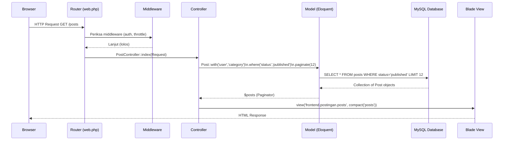
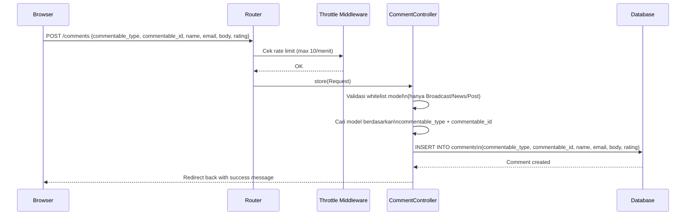
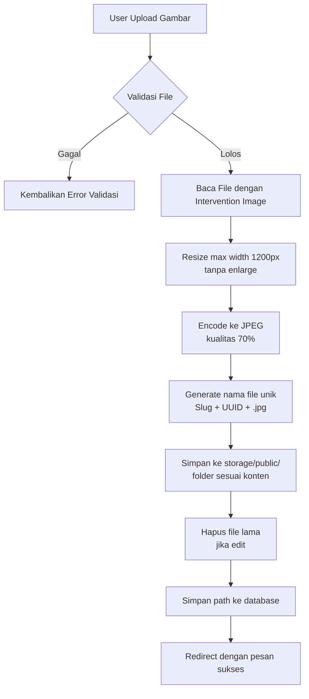

# 🧩 Class Diagram — Website TVRI D.I. Yogyakarta

**Framework:** Laravel 11 (PHP 8.2)  
**Pattern:** MVC + Eloquent ORM

---

## 1. Class Diagram — Models (Eloquent)

```mermaid
classDiagram
    direction TB

    class User {
        +bigint id
        +string name
        +string username
        +string email
        +string password
        +boolean is_admin
        +HasMany posts()
        +HasMany news()
        +HasMany broadcasts()
    }

    class Category {
        +bigint id
        +string name
        +string slug
        +string color
        +string color_classes()
        +HasMany posts()
    }

    class Post {
        +bigint id
        +bigint user_id
        +bigint category_id
        +string title
        +string slug
        +text body
        +string featured_image
        +text excerpt
        +enum status
        +timestamp published_at
        +bigint views
        +string link_postingan
        +BelongsTo user()
        +BelongsTo category()
        +MorphMany comments()
        #booted()
    }

    class NewsCategory {
        +bigint id
        +string name
        +string slug
        +HasMany news()
    }

    class News {
        +bigint id
        +bigint user_id
        +bigint news_category_id
        +string title
        +string slug
        +text body
        +string featured_image
        +enum status
        +bigint views
        +BelongsTo user()
        +BelongsTo newsCategory()
        +MorphMany comments()
        #booted()
    }

    class BroadcastCategory {
        +bigint id
        +string name
        +string slug
        +string color
        +string color_classes()
        +HasMany broadcasts()
        +HasMany jadwalAcaras()
    }

    class Broadcast {
        +bigint id
        +bigint user_id
        +bigint broadcast_category_id
        +string title
        +string slug
        +text synopsis
        +string poster
        +string youtube_link
        +enum status
        +boolean is_active
        +BelongsTo user()
        +BelongsTo broadcastCategory()
        +MorphMany comments()
        #booted()
    }

    class Comment {
        +bigint id
        +bigint commentable_id
        +string commentable_type
        +string name
        +string email
        +text body
        +tinyint rating
        +MorphTo commentable()
    }

    class JadwalCategory {
        +bigint id
        +string name
        +string slug
        +string color
        +integer order
        +string color_classes()
        +HasMany jadwalAcaras()
    }

    class JadwalAcara {
        +bigint id
        +bigint jadwal_category_id
        +bigint broadcast_category_id
        +string title
        +string slug
        +time start_time
        +time end_time
        +boolean is_active
        +BelongsTo jadwalCategory()
        +BelongsTo broadcastCategory()
    }

    class Banner {
        +bigint id
        +string title
        +text subtitle
        +string image_path
        +string link
        +string button_text
        +integer order
        +boolean is_active
    }

    class VisiMisi {
        +bigint id
        +enum type
        +text content
        +string image
        +integer order
        +boolean is_active
    }

    class History {
        +bigint id
        +string title
        +text content
        +string image
        +enum status
        +timestamp published_at
    }

    class TugasFungsi {
        +bigint id
        +enum type
        +integer order
        +string image
        +text content
        +boolean is_active
    }

    class Prestasi {
        +bigint id
        +string title
        +string award_name
        +string type
        +string category
        +year year
        +text description
        +boolean is_active
    }

    class HymneTvri {
        +bigint id
        +string title
        +string info
        +string poster
        +text synopsis
        +string link
        +boolean is_active
    }

    class Ppid {
        +bigint id
        +string title
        +text description
        +string source_link
        +string cover_image
        +boolean is_active
    }

    class ReformasiRb {
        +bigint id
        +string title
        +string slug
        +text description
        +string file_link
        +boolean is_active
    }

    class InfoMagang {
        +bigint id
        +string title
        +string slug
        +text description
        +string source_link
        +boolean is_active
    }

    class InfoMagangFaq {
        +bigint id
        +string question
        +text answer
        +integer order
        +boolean is_active
    }

    class InfoKunjungan {
        +bigint id
        +string title
        +string slug
        +text description
        +string source_link
        +boolean is_active
    }

    class InfoKunjunganFaq {
        +bigint id
        +string question
        +text answer
        +integer order
        +boolean is_active
    }

    class SocialMedia {
        +bigint id
        +string email
        +string instagram
        +string twitter
        +string facebook
        +string tiktok
        +string youtube
        +string phone
    }

    class ContactInfo {
        +bigint id
        +string admin_phone
        +string partnership_phone
        +string hotline_phone
        +text address
        +string email
        +string google_maps_embed
        +boolean is_active
    }

    %% === RELASI ===
    User "1" --> "N" Post : writes
    User "1" --> "N" News : writes
    User "1" --> "N" Broadcast : manages

    Category "1" --> "N" Post : categorizes
    NewsCategory "1" --> "N" News : categorizes
    BroadcastCategory "1" --> "N" Broadcast : categorizes
    BroadcastCategory "1" --> "N" JadwalAcara : used by
    JadwalCategory "1" --> "N" JadwalAcara : groups

    Post "1" --> "N" Comment : receives
    News "1" --> "N" Comment : receives
    Broadcast "1" --> "N" Comment : receives
    Comment --> Post : commentable (polymorphic)
    Comment --> News : commentable (polymorphic)
    Comment --> Broadcast : commentable (polymorphic)
```

---

## 2. Class Diagram — Controllers

```mermaid
classDiagram
    direction LR

    class Controller {
        <<abstract>>
    }

    %% === FRONTEND CONTROLLERS ===
    class HomeController {
        +index() View
        -getHeroSlides() Collection
        -getTodaySchedules() Collection
    }

    class PostController {
        +index(Request) View
        +show(string slug) View
    }

    class NewsController {
        +index(Request) View
        +show(string slug) View
    }

    class BroadcastController {
        +index(Request) View
        +show(Broadcast) View
    }

    class CommentController {
        +store(Request) RedirectResponse
    }

    class JadwalController {
        +index(Request) View
    }

    class StreamingController {
        +index() View
    }

    class LoginController {
        +showLoginForm() View
        +login(Request) RedirectResponse
        +logout(Request) RedirectResponse
    }

    %% === DASHBOARD CONTROLLERS ===
    class DashboardController {
        +index() View
    }

    class DashboardPostController {
        +index(Request) View
        +create() View
        +store(Request) RedirectResponse
        +edit(Post) View
        +update(Request, Post) RedirectResponse
        +destroy(Post) RedirectResponse
    }

    class DashboardNewsController {
        +index(Request) View
        +create() View
        +store(Request) RedirectResponse
        +edit(News) View
        +update(Request, News) RedirectResponse
        +destroy(News) RedirectResponse
    }

    class DashboardBroadcastController {
        +index(Request) View
        +create() View
        +store(Request) RedirectResponse
        +edit(Broadcast) View
        +update(Request, Broadcast) RedirectResponse
        +destroy(Broadcast) RedirectResponse
    }

    class DashboardCommentController {
        +index(Request) View
        +destroy(Comment) RedirectResponse
    }

    class DashboardUserController {
        +index(Request) View
        +create() View
        +store(Request) RedirectResponse
        +edit(User) View
        +update(Request, User) RedirectResponse
        +destroy(User) RedirectResponse
    }

    class DashboardContactInfoController {
        +index() View
        +store(Request) RedirectResponse
        +update(Request, ContactInfo) RedirectResponse
    }

    Controller <|-- HomeController
    Controller <|-- PostController
    Controller <|-- NewsController
    Controller <|-- BroadcastController
    Controller <|-- CommentController
    Controller <|-- JadwalController
    Controller <|-- StreamingController
    Controller <|-- LoginController
    Controller <|-- DashboardController
    Controller <|-- DashboardPostController
    Controller <|-- DashboardNewsController
    Controller <|-- DashboardBroadcastController
    Controller <|-- DashboardCommentController
    Controller <|-- DashboardUserController
    Controller <|-- DashboardContactInfoController
```

---

## 3. Arsitektur Request–Response Flow

---

## 4. Polymorphic Comment Flow

---

## 5. Image Upload Processing Flow

---

**© 2026 TVRI Stasiun D.I. Yogyakarta — Dokumentasi Teknis**
