# 🗄️ Dokumentasi Database — Website TVRI D.I. Yogyakarta

**Total Tabel:** 25 tabel aktif  
**DBMS:** MySQL 8  
**Framework ORM:** Laravel Eloquent

---

## 1. Entity Relationship Diagram (ERD)

```mermaid
erDiagram
    users {
        bigint id PK
        string name
        string username UK
        string email UK
        string password
        boolean is_admin
        timestamp email_verified_at
        string remember_token
        timestamps created_at
        timestamps updated_at
    }

    categories {
        bigint id PK
        string name
        string slug UK
        string color
        timestamps created_at
        timestamps updated_at
    }

    posts {
        bigint id PK
        bigint user_id FK
        bigint category_id FK
        string title
        string slug UK
        text body
        string featured_image
        text excerpt
        enum status
        timestamp published_at
        string meta_title
        string meta_description
        bigint views
        string link_postingan
        timestamps created_at
        timestamps updated_at
    }

    news_categories {
        bigint id PK
        string name
        string slug UK
        timestamps created_at
        timestamps updated_at
    }

    news {
        bigint id PK
        bigint user_id FK
        bigint news_category_id FK
        string title
        string slug UK
        text body
        string featured_image
        text excerpt
        string link_berita
        enum status
        timestamp published_at
        string meta_title
        string meta_description
        bigint views
        timestamps created_at
        timestamps updated_at
    }

    broadcast_categories {
        bigint id PK
        string name
        string slug UK
        string color
        timestamps created_at
        timestamps updated_at
    }

    broadcasts {
        bigint id PK
        bigint user_id FK
        bigint broadcast_category_id FK
        string title
        string slug UK
        text synopsis
        string poster
        string youtube_link
        enum status
        boolean is_active
        timestamp published_at
        timestamps created_at
        timestamps updated_at
    }

    jadwal_categories {
        bigint id PK
        string name
        string slug UK
        string color
        integer order
        timestamps created_at
        timestamps updated_at
    }

    jadwal_acaras {
        bigint id PK
        bigint jadwal_category_id FK
        bigint broadcast_category_id FK
        string title
        string slug UK
        time start_time
        time end_time
        boolean is_active
        timestamps created_at
        timestamps updated_at
    }

    comments {
        bigint id PK
        bigint commentable_id
        string commentable_type
        string name
        string email
        text body
        tinyint rating
        timestamps created_at
        timestamps updated_at
    }

    banners {
        bigint id PK
        string title
        text subtitle
        string image_path
        string link
        string button_text
        integer order
        boolean is_active
        timestamps created_at
        timestamps updated_at
    }

    visi_misis {
        bigint id PK
        enum type
        text content
        string image
        integer order
        boolean is_active
        timestamps created_at
        timestamps updated_at
    }

    histories {
        bigint id PK
        string title
        text content
        string image
        enum status
        timestamp published_at
        timestamps created_at
        timestamps updated_at
    }

    tugas_fungsis {
        bigint id PK
        enum type
        integer order
        string image
        text content
        boolean is_active
        timestamps created_at
        timestamps updated_at
    }

    prestasis {
        bigint id PK
        string title
        string award_name
        string type
        string category
        year year
        text description
        string image
        boolean is_active
        timestamps created_at
        timestamps updated_at
    }

    hymne_tvris {
        bigint id PK
        string title
        string info
        string poster
        text synopsis
        string link
        boolean is_active
        timestamps created_at
        timestamps updated_at
    }

    ppids {
        bigint id PK
        string title
        text description
        string source_link
        string cover_image
        boolean is_active
        timestamps created_at
        timestamps updated_at
    }

    reformasi_rbs {
        bigint id PK
        string title
        string slug UK
        text description
        string file_link
        string cover_image
        boolean is_active
        timestamps created_at
        timestamps updated_at
    }

    info_magangs {
        bigint id PK
        string title
        string slug UK
        text description
        string source_link
        string cover_image
        boolean is_active
        timestamps created_at
        timestamps updated_at
    }

    info_magang_faqs {
        bigint id PK
        string question
        text answer
        integer order
        boolean is_active
        timestamps created_at
        timestamps updated_at
    }

    info_kunjungans {
        bigint id PK
        string title
        string slug UK
        text description
        string source_link
        string cover_image
        boolean is_active
        timestamps created_at
        timestamps updated_at
    }

    info_kunjungan_faqs {
        bigint id PK
        string question
        text answer
        integer order
        boolean is_active
        timestamps created_at
        timestamps updated_at
    }

    social_medias {
        bigint id PK
        string email
        string instagram
        string twitter
        string facebook
        string tiktok
        string youtube
        string phone
        timestamps created_at
        timestamps updated_at
    }

    contact_infos {
        bigint id PK
        string admin_phone
        string partnership_phone
        string hotline_phone
        text address
        string email
        string google_maps_embed
        boolean is_active
        timestamps created_at
        timestamps updated_at
    }

    users ||--o{ posts : "menulis"
    users ||--o{ news : "menulis"
    users ||--o{ broadcasts : "mengelola"
    categories ||--o{ posts : "mengkategorikan"
    news_categories ||--o{ news : "mengkategorikan"
    broadcast_categories ||--o{ broadcasts : "mengkategorikan"
    broadcast_categories ||--o{ jadwal_acaras : "digunakan"
    jadwal_categories ||--o{ jadwal_acaras : "mengelompokkan"

    posts ||--o{ comments : "menerima (polymorphic)"
    news ||--o{ comments : "menerima (polymorphic)"
    broadcasts ||--o{ comments : "menerima (polymorphic)"
```



---

## 2. Logical Record Structure (LRS)

LRS menggambarkan hubungan antar tabel beserta atribut kunci secara lebih detail.

```
┌──────────────────────────────────────────────────────────────────┐
│                    KONTEN UTAMA (Content Core)                     │
└──────────────────────────────────────────────────────────────────┘

users (id*, name, username°, email°, password, is_admin, ...)
    │
    ├──────────────────────────────────────────────────┐
    │                                                  │
    ▼                                                  ▼
posts (id*, user_id**, category_id**, title,        news (id*, user_id**, news_category_id**,
       slug°, body, featured_image, excerpt,              title, slug°, body, featured_image,
       status, published_at, views, ...)                  excerpt, status, published_at, views, ...)
    │                                                      │
    └──────────────────┐               ┌──────────────────┘
                       ▼               ▼
                   comments (id*, commentable_id, commentable_type,
                             name, email, body, rating, ...)
                       ▲
                       │
categories         broadcasts (id*, user_id**, broadcast_category_id**,
(id*, name,                    title, slug°, synopsis, poster,
 slug°, color)                 youtube_link, status, is_active, ...)
    │                   │
    ▼                   ▼
posts.**category_id   broadcast_categories (id*, name, slug°, color)
                          │
                          ├──────────────────────────────────┐
                          ▼                                  ▼
                   jadwal_acaras (id*, jadwal_category_id**, broadcast_category_id**,
                                  title, slug°, start_time, end_time, is_active, ...)
                          
jadwal_categories (id*, name, slug°, color, order)
    │
    ▼
jadwal_acaras.**jadwal_category_id


news_categories (id*, name, slug°)
    │
    ▼
news.**news_category_id

┌──────────────────────────────────────────────────────────────────┐
│                   PROFIL INSTANSI (Static Pages)                   │
└──────────────────────────────────────────────────────────────────┘

visi_misis      (id*, type[visi|misi], content, image, order, is_active)
histories       (id*, title, content, image, status, published_at)
tugas_fungsis   (id*, type[tugas|fungsi], order, image, content, is_active)
prestasis       (id*, title, award_name, type, category, year, description, image, is_active)
hymne_tvris     (id*, title, info, poster, synopsis, link, is_active)

┌──────────────────────────────────────────────────────────────────┐
│                   LAYANAN PUBLIK (Public Services)                 │
└──────────────────────────────────────────────────────────────────┘

ppids           (id*, title, description, source_link, cover_image, is_active)
reformasi_rbs   (id*, title, slug°, description, file_link, cover_image, is_active)

info_magangs    (id*, title, slug°, description, source_link, cover_image, is_active)
info_magang_faqs (id*, question, answer, order, is_active)
    [Note: Tidak ada FK langsung — FAQ bersifat global untuk halaman Magang]

info_kunjungans  (id*, title, slug°, description, source_link, cover_image, is_active)
info_kunjungan_faqs (id*, question, answer, order, is_active)
    [Note: Tidak ada FK langsung — FAQ bersifat global untuk halaman Kunjungan]

┌──────────────────────────────────────────────────────────────────┐
│                   PENGATURAN (Settings)                            │
└──────────────────────────────────────────────────────────────────┘

banners         (id*, title, subtitle, image_path, link, button_text, order, is_active)
social_medias   (id*, email, instagram, twitter, facebook, tiktok, youtube, phone)
contact_infos   (id*, admin_phone, partnership_phone, hotline_phone,
                      address, email, google_maps_embed, is_active)

┌──────────────────────────────────────────────────────────────────┐
│                   SISTEM (Laravel Internal)                         │
└──────────────────────────────────────────────────────────────────┘

sessions        (id*, user_id**, ip_address, user_agent, payload, last_activity)
cache           (key*, value, expiration)
jobs            (id*, queue, payload, attempts, ...)
password_reset_tokens (email*, token, created_at)

Keterangan: * = Primary Key, ** = Foreign Key, ° = Unique
```

---

## 3. Kamus Data (Data Dictionary)

### Tabel: `users`

| Kolom | Tipe | Null | Default | Keterangan |
|-------|------|------|---------|------------|
| id | bigint UNSIGNED | No | Auto | Primary Key |
| name | varchar(255) | No | — | Nama lengkap pengguna |
| username | varchar(255) | No | — | Username unik untuk login |
| email | varchar(255) | No | — | Email unik |
| password | varchar(255) | No | — | Hash Bcrypt |
| is_admin | tinyint(1) | No | 0 | Flag hak akses (1=Admin) |
| remember_token | varchar(100) | Yes | NULL | Token "ingat saya" |
| created_at | timestamp | Yes | NULL | Waktu dibuat |
| updated_at | timestamp | Yes | NULL | Waktu diperbarui |

### Tabel: `posts`

| Kolom | Tipe | Null | Default | Keterangan |
|-------|------|------|---------|------------|
| id | bigint UNSIGNED | No | Auto | Primary Key |
| user_id | bigint UNSIGNED | No | — | FK → users.id (CASCADE DELETE) |
| category_id | bigint UNSIGNED | No | — | FK → categories.id (RESTRICT DELETE) |
| title | varchar(255) | No | — | Judul postingan |
| slug | varchar(255) | No | — | URL slug (unique) |
| body | text | No | — | Konten HTML dari Trix Editor |
| featured_image | varchar(255) | Yes | NULL | Path gambar di storage |
| excerpt | text | Yes | NULL | Ringkasan untuk preview |
| status | enum | No | draft | `draft` atau `published` |
| published_at | timestamp | Yes | NULL | Waktu dipublikasikan |
| meta_title | varchar(255) | Yes | NULL | SEO title |
| meta_description | varchar(255) | Yes | NULL | SEO description |
| views | bigint UNSIGNED | No | 0 | Counter tampilan |
| link_postingan | varchar(255) | Yes | NULL | Link sumber eksternal |

### Tabel: `news`

| Kolom | Tipe | Null | Default | Keterangan |
|-------|------|------|---------|------------|
| id | bigint UNSIGNED | No | Auto | Primary Key |
| user_id | bigint UNSIGNED | No | — | FK → users.id (CASCADE DELETE) |
| news_category_id | bigint UNSIGNED | No | — | FK → news_categories.id (RESTRICT) |
| title | varchar(255) | No | — | Judul berita |
| slug | varchar(255) | No | — | URL slug (unique) |
| body | text | No | — | Konten HTML |
| featured_image | varchar(255) | Yes | NULL | Path gambar |
| excerpt | text | Yes | NULL | Ringkasan |
| link_berita | varchar(255) | Yes | NULL | Link sumber eksternal |
| status | enum | No | draft | `draft` atau `published` |
| published_at | timestamp | Yes | NULL | Waktu publish |
| meta_title | varchar(255) | Yes | NULL | SEO title |
| meta_description | varchar(255) | Yes | NULL | SEO description |
| views | bigint UNSIGNED | No | 0 | Counter tampilan |

### Tabel: `broadcasts`

| Kolom | Tipe | Null | Default | Keterangan |
|-------|------|------|---------|------------|
| id | bigint UNSIGNED | No | Auto | Primary Key |
| user_id | bigint UNSIGNED | No | — | FK → users.id (CASCADE DELETE) |
| broadcast_category_id | bigint UNSIGNED | No | — | FK → broadcast_categories.id (RESTRICT) |
| title | varchar(255) | No | — | Nama program siaran |
| slug | varchar(255) | No | — | URL slug (unique) |
| synopsis | text | Yes | NULL | Sinopsis program |
| poster | varchar(255) | Yes | NULL | Path gambar poster |
| youtube_link | varchar(255) | Yes | NULL | URL YouTube trailer |
| status | enum | No | draft | `draft` atau `published` |
| is_active | tinyint(1) | No | 1 | Flag tampil di frontend |
| published_at | timestamp | Yes | NULL | Waktu publish |

### Tabel: `comments` *(Polymorphic)*

| Kolom | Tipe | Null | Default | Keterangan |
|-------|------|------|---------|------------|
| id | bigint UNSIGNED | No | Auto | Primary Key |
| commentable_id | bigint UNSIGNED | No | — | ID konten induk (Post/News/Broadcast) |
| commentable_type | varchar(255) | No | — | Nama class model induk |
| name | varchar(255) | No | — | Nama pengunjung |
| email | varchar(255) | No | — | Email pengunjung |
| body | text | No | — | Isi komentar |
| rating | tinyint UNSIGNED | Yes | NULL | Rating 1–5 bintang |

### Tabel: `jadwal_acaras`

| Kolom | Tipe | Null | Default | Keterangan |
|-------|------|------|---------|------------|
| id | bigint UNSIGNED | No | Auto | Primary Key |
| jadwal_category_id | bigint UNSIGNED | No | — | FK → jadwal_categories.id |
| broadcast_category_id | bigint UNSIGNED | No | — | FK → broadcast_categories.id (RESTRICT) |
| title | varchar(255) | No | — | Nama acara |
| slug | varchar(255) | No | — | URL slug (unique) |
| start_time | time | No | — | Jam tayang mulai |
| end_time | time | Yes | NULL | Jam tayang selesai |
| is_active | tinyint(1) | No | 1 | Status aktif |

---

## 4. Ringkasan Relasi Database

| Relasi | Tipe | Keterangan |
|--------|------|------------|
| users → posts | 1:N | Satu user menulis banyak postingan |
| users → news | 1:N | Satu user menulis banyak berita |
| users → broadcasts | 1:N | Satu user mengelola banyak program siaran |
| categories → posts | 1:N | Satu kategori memiliki banyak postingan |
| news_categories → news | 1:N | Satu kategori memiliki banyak berita |
| broadcast_categories → broadcasts | 1:N | Satu kategori memiliki banyak program |
| broadcast_categories → jadwal_acaras | 1:N | Satu kategori digunakan banyak jadwal |
| jadwal_categories → jadwal_acaras | 1:N | Satu kategori hari memiliki banyak jadwal |
| posts → comments | 1:N (Polymorphic) | Satu postingan memiliki banyak komentar |
| news → comments | 1:N (Polymorphic) | Satu berita memiliki banyak komentar |
| broadcasts → comments | 1:N (Polymorphic) | Satu program memiliki banyak komentar |

---

**© 2026 TVRI Stasiun D.I. Yogyakarta — Dokumentasi Database**
